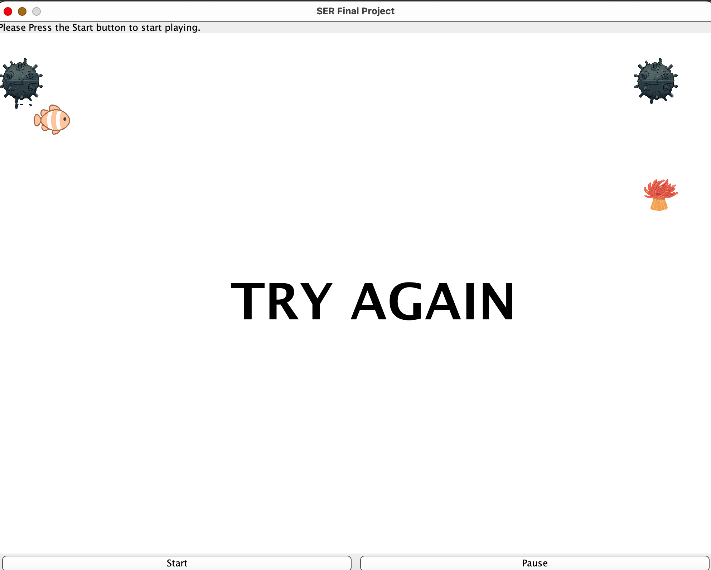

# Simple- 2D Game

## What is This? 
A simple 2-D game designed for Quinnipiac's SER 120 Final Project. Collaborated with several others to design a simple 2-D game engine. The game was designed using the Java Swing Library and other object oriented principles learned throughout the semester, such as Abstraction, Encapsulation, Inheritance, and Polymorphism. I tried to modify features in the game that would make it enjoyable, such as changing the speeds of the enemies.

## Goal of the Game
The goal of the game is to avoid getting hit by the sea mines and make it to end. If the fish manages to reach the objective, then the user wins. Other wise, the user fails and is greeted with a message to try again. The user has ulimited amount of times to avoid getting hit by the sea mines. 

## How to Play
To move the fish upwards, press the up arrow key. To move the fish downwards, press the down arrow key. To move the fish to the right, press the right arrow key. To move the fish to the left, press the left arrow key. If for some reason you need to pause the game, there's a pause button that will stop the game from operating. 

## Minimum Enviorment Requirements
Make sure to have java 1.8 installed. I recommend on testing the game on Eclipse or your preferrable IDE.